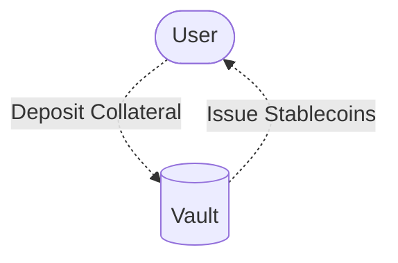
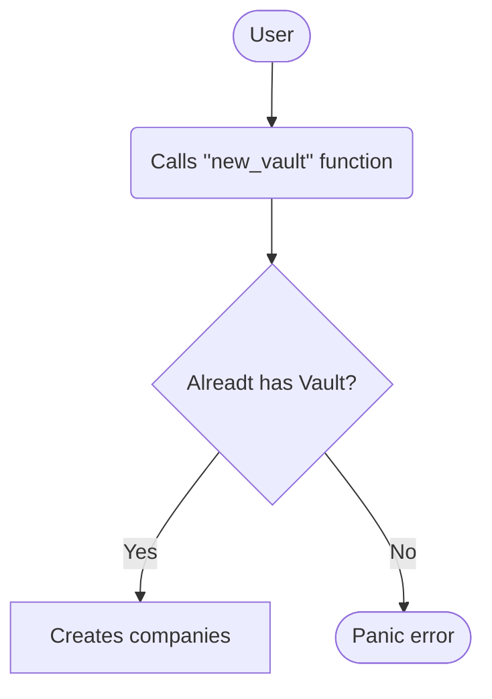

# Vaults logic flows

## Key features the contract requires

## Creation of a Vault

The creation of a Vault occurs when a Participant deposits a Collateral Asset and receives stablecoins in exchange.

There are multiple rules around creating a vault

