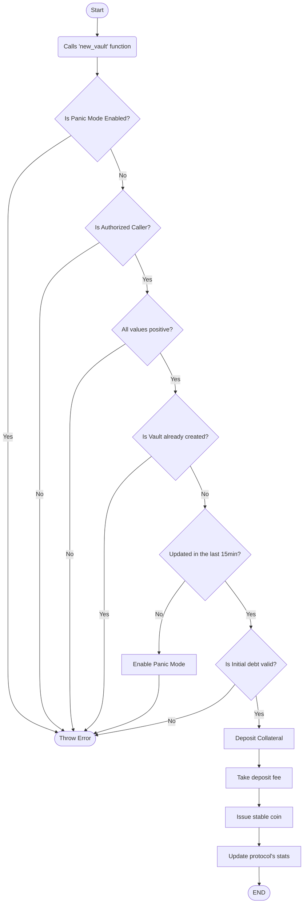

# Vaults logic flows

## New Vault (new_vault)

## Creation of a Vault
The creation of a Vault occurs when a Participant deposits a Collateral Asset and receives stablecoins in exchange.

There are multiple rules around creating a vault

